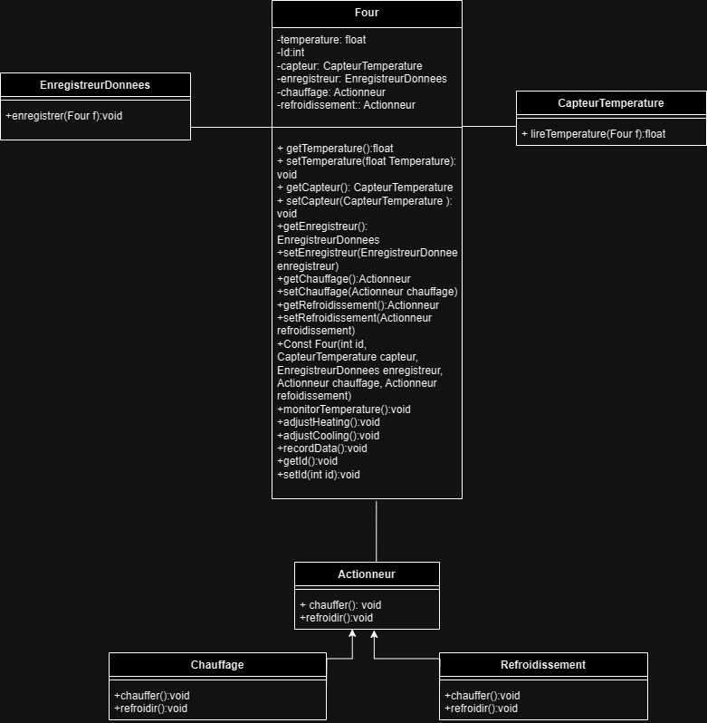

# Systememecatronique.java

## Description
This is an initial project for a mechatronic system simulation. The project is in its early stages and serves as a foundation for future development. The code is written in Java and aims to simulate basic mechatronic system behaviors.

## UML Diagram
Below is the UML diagram for the project:

## Getting Started
To get started with the project, clone the repository and open it in your preferred Java development environment. Ensure you have the necessary dependencies installed.

## Contributing
Contributions are welcome! Please feel free to fork the repository and submit pull requests.

## License
This project is licensed under the MIT License - see the [LICENSE](LICENSE) file for details.

---

Feel free to expand this README as the project grows!
